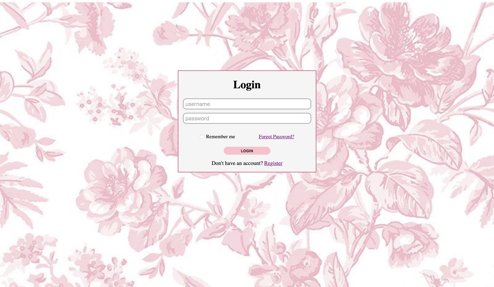

<h1> LOGIN PAGE </h1>

A reponsive login page built using HTML and CSS. This project demonstrates the fundamentals of web design by creating a clean and user-friendly login interface.



<h2> Features </h2>

<ul>
    <li> Responsive layout </li>
    <li> Modern and clean design </li>
    <li> Username and paassword login </li>
    <li> Login button </li>
    <li> Built with only HTML and CSS </li>
</ul>

<h2> Technologies Used </h2>

<ul>
    <li> HTML5 </li>
    <li> CSS </li>
</ul>

<h2> Project Structure </h2>

```
└── 📁login-page
    ├── index.html
    ├── style.css
    |
    └── 📁images
        ├── pink-floral-bg.jpg
    └── README.md
```

<h2> Getting Started </h2>

<ol>
    <li> Download or clone this repository. </li>
    <li> Open the project folder. </li>
    <li> Double-click <em>index.html</em>, or open it in your preferred web browser.
</ol>

<p> No additonal software or installation is needed </p>

<h2> Future Improvements </h2>

<ul>
    <li> scale the background image more properly </li>
    <li> adjust the responsiveness of input elements </li>
    <li> improve accessibility </li>
</ul>

<h2> Author </h2>
<p> Created by Anaia Johnson as a beginner web development practice project. </p>
